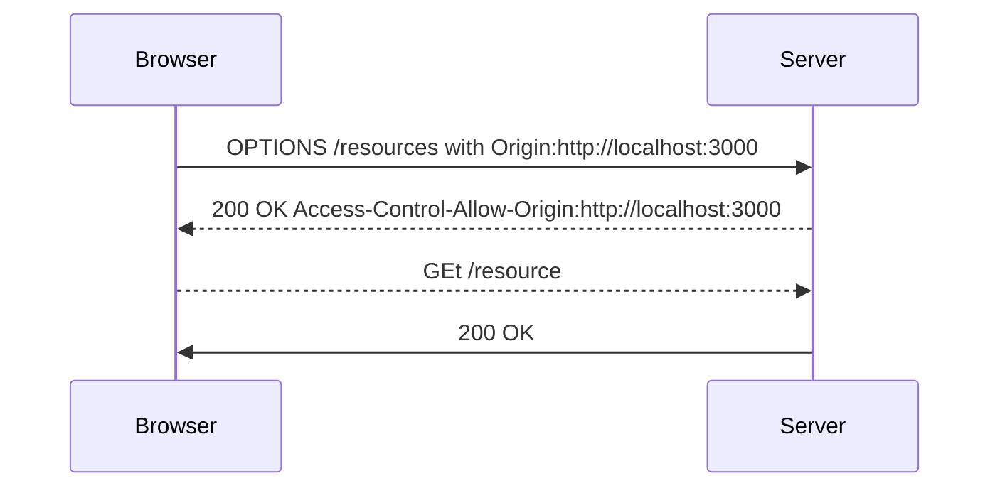

# 프로젝트 개요


이 프로젝트는 스프링 부트의 기본적인 사용방법을 테스트하고 정리하기 위해서 생성했다. 

* 스프링 부트의 기본적인 사용방법 정리
* 스프링 부트의 설정방법 정리

# 프로젝트 환경
이 프로젝트의 기본적인 환경은 다음과 같다. 
* JDK 12 사용, 컴파일은 JDK 8과 호환되도록 했다. 
* Visual Studio Code를 사용한다. 
* 빌드는 Maven을 사용한다. 


# SpringBoot의 기본 설정 

* SpringBoot 최초 실행시에 포트는 8080
* 정적 리소스 파일 위치 
* src/main/resources 폴더 아래에 다음 폴더들은 브라우저에서 바로 호출 가능 
  * static
  * public 
* templates 파일들은 Controller를 통해서만 호출이 가능하다 


# Java Compiler 문제 
Maven은 컴파일 시에 pom.xml 파일의 java.version 속성의 영향을 받음. 
```xml
<properties>
  <java.version>12</java.version>
</properties>
```

VSCode에서 위 속성은 다음의 파일에 영향을 준다. 버전을 바꾸면 ..settings 폴더의 org.eclipse.jdt.core.prefs 파일의 자바 버전 정보를 변경한다. 이 설정 파일은 Eclipse에서 사용하는 파일이다. 

```properties
org.eclipse.jdt.core.compiler.codegen.targetPlatform=12
org.eclipse.jdt.core.compiler.compliance=12
org.eclipse.jdt.core.compiler.source=12
```

## 설치된 JRE가 없다는 오류 
VSCode에서 다음의 경고가 나오는 경우가 있다. 
```text
Build path specifies execution environment JavaSE-11. There are no JREs installed in the workspace that are strictly compatible with this environment. 
```
위 경고는 pom.xml 파일에서 버전을 11로 설정을 했지만 설치된 JDK가 없는 경우에 나온다. 실제로는 JDK 12가 설치되어 있다.  값을 12로 변경하면 경고가 나오지 않는다. 실제 컴파일하고 실행하는데에는 문제는 없다.

## 다른 버전의 JDK 버전이 사용되었다는 경고 
이 경고는 JDK 컴파일러 설정이 11로 되어 있지만 JDK 12가 사용되었다는 의미이다. pom.xml의 자바 버전을 12로 변경하면 경고가 사라진다. 실제 컴파일 하고 실행하는데에는 문제는 없다. 

```text
message": "The compiler compliance specified is 11 but a JRE 12 is used
```	

# SpringBoot Hot Reload 
VSCode나 IntelliJ에서 SpringBoot를 사용하는 경우에는 Hot Swap기능은 지원되지 않는다. 전체를 다시 리로드한다. VSCode에서는 방법이 없는 것 같고 IntelliJ에서는 돈 주고 써야한다. 

* 정적 자원들은 Hot Reload와는 관계 없음 
* src/main/java 폴더의 소스가 컴파일 되면 자동 reload는 되나 처음부터 다시 리로드하여 hot swap은 아니다


# Freemarker 사용하기 

* 확장자는 .ftl
* src/main/resources/templates 폴더에 파일을 생성
* application.properties에 View Resolver 설정을 해야 함  

```properties

# freemarker 
spring.freemarker.template-loader-path=classpath:/templates 
spring.freemarker.suffix=.ftl
```


## 프로젝트 구조
```shell
🗂️project_root
  🗂️src         // Java Maven Project Strucutre
     🗂️main
        🗂️java  // Java Source
        🗂️resources // Static Resources 
           🗂️mapper
             🗂️oracle
                🗂️ blog  // blog 모듈 매퍼 
                    📄BlogMapper.xml 
           🗂️translation  // 다국어 리소스 
              📄trans-message.yml  
              📄trans-message_ko.yml.yml                    
              📄trans-message_en.yml.yml                    
           🗂️public  // 개발과 관련없는 static resources
              📄help.html
           🗂️static  // JavaScipt, CSS, Image 등 
              // Vue를 사용하기 때문에 거의 사용할 일이 없을 듯 
              🗂️resources // 정적 리소스 
                🗂️css   // CSS 
                🗂️js    // Javascript
                   🗂️lib // 외부 Javascript Library
                   🗂️api // 모듈 Api
                🗂️image // Image
           🗂️templates  // Jsp와 같은 Dynamic Resource 
     🗂️test    
        🗂️java  // Test Case
          🗂️com
             🗂️sogood 
                🗂️ core // src/main/java package 구조와 동일한 패키지 구조 
                    📄CoreUtilTest.java   // com/soogd/core/CoreUtil.java의 테스트 케이스 
  🗂️vue // Vue Project Root
     🗂️public
     🗂️src // Vue source
        🗂️api        // API for business logic 
          🗂️core     // 공통 및 업무와 무관한 Javascript
          🗂️biz      // 모듈 JavaScript
            🗂️blog   // 블로그 모듈 , Typescript와 Javascript 사용
              🗂️usecase // UseCase, java의 Service와 같음 
                 📄BlogManagerUseCase.ts  // 모듈명 접두사, UseCase 접미사 사용
                 📄BlogPostUseCase.ts


              🗂️repository // Java의 DAO 또는 Mapper와 같음           
                📄BlogMangerRepository.ts  // 모듈명 접두사, Repository 접미사 사용
                📄BlogPostRepository.ts
        🗂️assets     // for static resources. eg. image, css, icons, fonts, style
           🗂️image
           🗂️css 
        🗂️components // components
           🗂️common   // 의미별로 묶어서 디렉터리 구성
              📄Calendar.vue
              📄DatePicker.vue         
        🗂️plugins    // Vue plugins
           📄FetchPlugin.js
        🗂️routes     // routers
        🗂️store      // Vuex
        🗂️views      // views  
          🗂️blog
             📄BlogMain.vue
             📄BlogEdit.vue
             📄BlogList.vue
     📄.gitignore
     📄index.html
     📄package.json
     📄vite.config.js
```  


# Naming Rule

## Back-end
### Request Mapping 

dash로 연결한다. 

 * select- DB 처리가 필요한 가져오기 
 * insert- DB 처리가 필요한 입력 
 * update- DB 처리가 필요한 입력/수정 
 * delete- DB 처리가 필요한 삭제 


예
select-user-info 
delete-user 


### Service

Camel Notation 사용 

* select- DB 처리가 필요한 가져오기 
* insert- DB 처리가 필요한 입력 
* update- DB 처리가 필요한 입력/수정 
* delete- DB 처리가 필요한 삭제 
* 기타  DB 처리가 필요 없는 메서드 


### Mapper 

* select- DB 처리가 필요한 가져오기 
* insert- DB 처리가 필요한 입력 
* update- DB 처리가 필요한 입력/수정 
* delete- DB 처리가 필요한 삭제 


## Front-end 
### Repository 

* select DB 처리가 필요한 가져오기 
* insert DB 처리가 필요한 입력 
* update DB 처리가 필요한 입력/수정 
* delete DB 처리가 필요한 삭제 
* 기타  DB 처리가 필요 없는 메서드 


### UseCase 

isUserLogined
사용자가 로그인했는지 체크하기 위해서 두 가지 방법을 사용할 수 있는데 

하나는, store에서 login 정보가 있는지 체크하는 것이고
다른 하나는, 서버에 세션이 있는지 체크하는 것이다. 


둘 다  isUserLogined() 이름을 사용할 수 있는데 구분이 되지 않는다. 

제안

isUserLoginedFromStroe 
isUserLoginedFromSession 

fetch  가져오기 
add 추가하기
update 수정하기
remove 제거하기 

get 가져오기 
insert 추가하기 
list 목록 가져오기 
update 변경하기 



